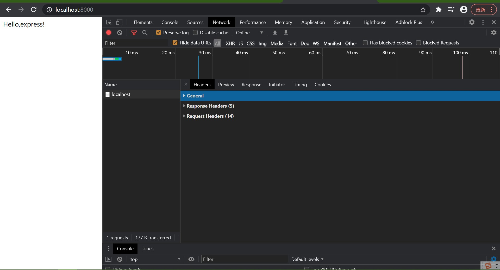
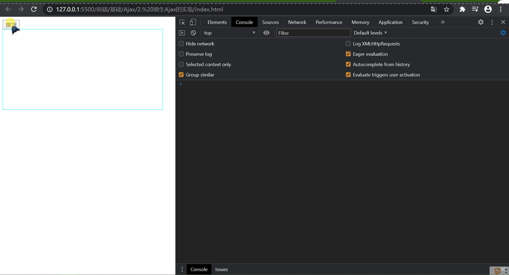
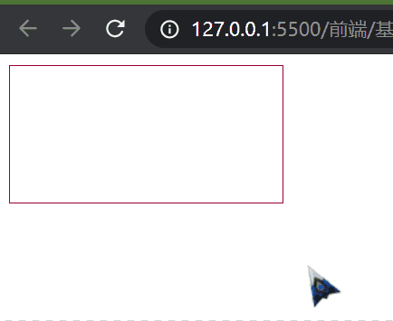
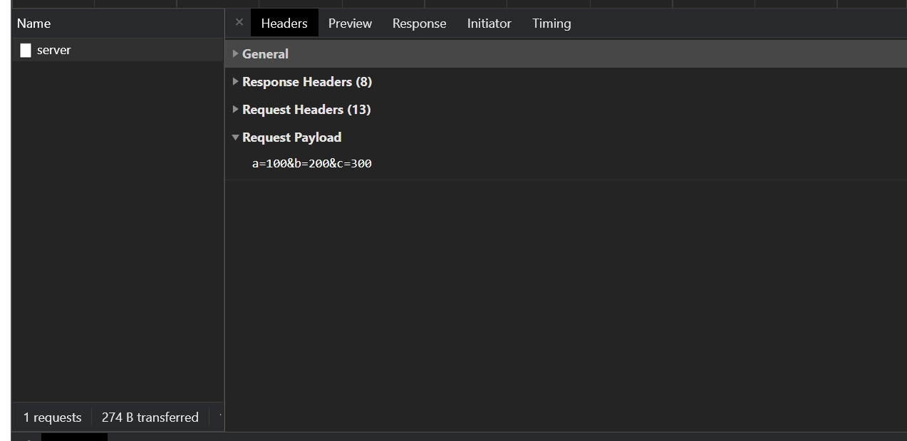
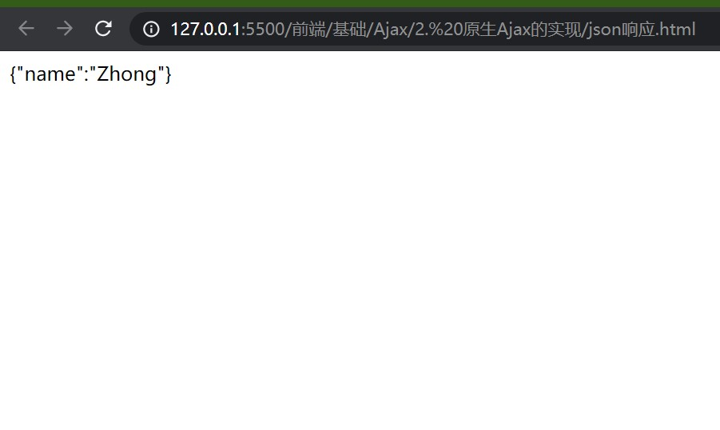
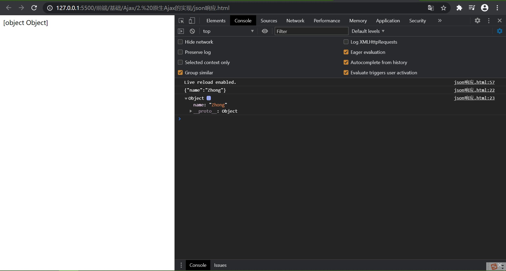
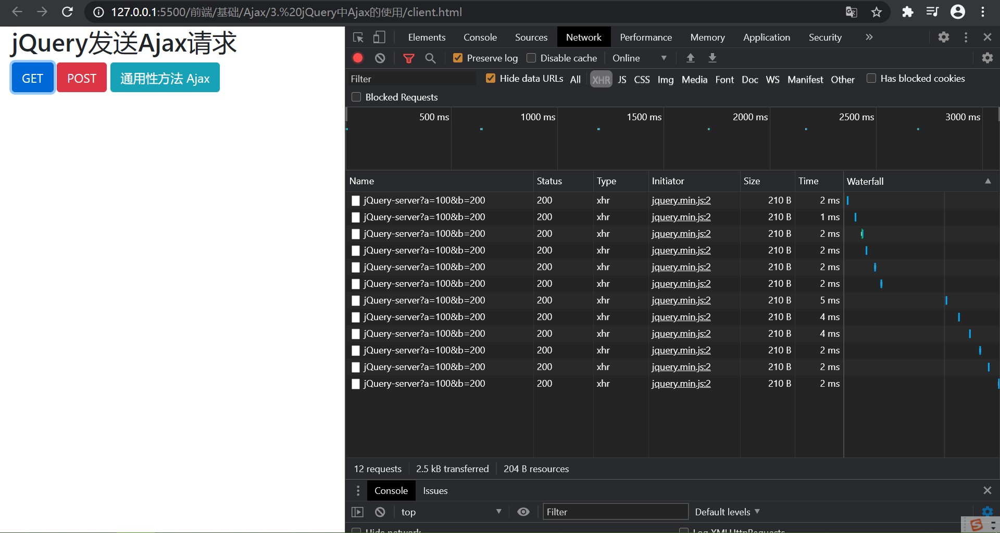

#### 1. AJAX 概念

AJAX 即 Asynchronous JavaScript and XML（异步的 JavaScript 和 XML）。通过 AJAX 可以在浏览器中发送异步请求，主要用于无刷新获取数据。

在网页当中随处可见：

* 百度搜索的相关关键字推荐
* 注册登录告知用户名不可用
* ...

AJAX 发送的是 HTTP 请求，在后面的学习中，将涉及到以下的方式发送请求：

* 原生
* jQuery
* fetch
* axios

#### 2. XML 简介

XML 指可扩展标记语言，XML 被设计用来传输和存储数据。Ajax 最开始使用数据交换格式就是 XML。现在已经被 JSON 取代了。

#### 3. AJAX 的特点

优点：

* 无刷新获取数据
* 允许根据用户事件进行更新部分页面内容

缺点：

* 没有浏览历史，不能回退
* 存在跨域问题
* SEO 不友好

#### 4. HTTP 协议请求报文和响应文本结构

请求报文：

重点是格式与参数

``` c
请求行  POST URL HTTP/1.1
请求头  Host\Cookie\Content-type\User-Agent
空行
体      username=admin&password=admin
```

> 注意 GET 请求的请求头是空的

响应报文：

``` c
响应行  HTTP/1.1 200 OK
响应头  Content-Type\Content-length\Content-encoding
空行
响应体  返回了 html 
```

#### 5. 浏览器控制台查看请求

能在浏览器的控制台上查看 network 的请求、响应报文即可

#### 6. 基于 NodeJS 的 express 框架

要使用 AJAX ，我们需要一个服务器后台，在这里选择 express 框架。

了解 express 的基本使用：

``` js
// 1. CommonJS 规范引入 express
const express = require("express");

// 2. 创建对象
const app = express();

// 3. 创建路由规则
// request 是对请求报文的封装
// response 是对响应报文的封装
app.get('/', (request, response) => {
    // 设置响应
    response.send("Hello,express!");
});

// 4. 监听端口启动服务
app.listen(8000, () => {
    console.log("服务已经启动，8000端口监听中...");
});
```

NodeJS 启动服务：

``` bash
node express的基本使用.js
```

在浏览器（http://localhost:8000/） 查看请求报文和响应报文：



#### 7. 原生 AJAX 的实现

需要了解 `XMLHttpRequest` 对象。

后端：*/server.js*

``` js
const express = require("express");
const app = express();

app.get('/server', (request, response) => {
    // 设置响应头以允许跨域 
    response.setHeader("Access-Control-Allow-Origin", "*");
    // 设置响应体
    response.send();
});

app.listen(8000, () => {
    console.log("服务已启动 8000端口...");
})
```

前端发送 get 请求：*/get.html*

``` html
<!DOCTYPE html>
<html lang="en">

<head>
    <meta charset="UTF-8">
    <meta http-equiv="X-UA-Compatible" content="IE=edge">
    <meta name="viewport" content="width=device-width, initial-scale=1.0">
    <title>Document</title>
    <style>
        #container {
            width: 400px;
            height: 200px;
            border: solid 1px aqua;
        }
    </style>
</head>

<body>
    <button>按钮</button>
    <div id="container"></div>
    <script>
        const btn = document.getElementsByTagName("button")[0];
        btn.onclick = function() {
            // 实现 Ajax
            // 1. 创建 XHR 对象
            let xhr = new XMLHttpRequest();
            // 2. 初始化 （设置请求方法和 url）
            xhr.open("GET", "http://127.0.0.1:8000/server");
            // 3. 发送
            xhr.send();
            // 4. 事件绑定 处理服务器返回的结果
            // 当状态改变时会触发事件
            xhr.onreadystatechange = function() {
                // readyState 是 XHR 对象的属性，保存0,1,2,3,4值，当值改变时会触发改事件
                // 值状态分别对应 未初始化|已初始化|已发送|服务端返回部分结果|服务端返回全部结果
                if (xhr.readyState === 4) {
                    // status 是 XHR 对象属性，对应响应状态码
                    if (xhr.status >= 200 && xhr.status < 300) {
                        // 处理结果
                        // 响应体
                        console.log(xhr.status); // 200
                        console.log(xhr.statusText); // ok
                        console.log(xhr.getAllResponseHeaders()); // content-length: 0
                    }
                }
            }
        }
    </script>
</body>

</html>
```

结果：



##### AJAX 设置请求参数

在 url 中设置参数即可：

``` js
// xhr.open("GET","http://127.0.0.1:8000/server");
xhr.open("GET", "http://127.0.0.1:8000/server?a=100&b=200&c=300");
```

##### 发送 post 请求

``` js
const result = document.getElementById("result");
result.addEventListener("mouseover", () => {
    const xhr = new XMLHttpRequest();
    xhr.open("POST", "http://127.0.0.1:8000/server");
    xhr.send();
    xhr.onreadystatechange = function() {
        if (xhr.readyState === 4) {
            if (xhr.status >= 200 && xhr.status < 300) {
                result.innerHTML = xhr.response;
            }
        }
    }
})
```

``` js
app.post('/server', (request, response) => {
    // 设置响应头以允许跨域 
    response.setHeader("Access-Control-Allow-Origin", "*");
    // 设置响应体
    response.send("Hello Ajax Post");
});
```

结果：



##### post 设置请求体

在 `xhr.send()` 设置即可：

``` js
xhr.send("a=100&b=200&c=300");
```

结果：



##### 设置请求头信息

在 xhr 对象初始化后即可设置请求头：

``` js
xhr.setRequestHeader("content-type", "application/x-www-form-urlencoded");
```

##### 服务端响应 json 数据

``` js
// 响应数据
const data = {
    name: "Zhong"
}
// 设置响应体
response.send(JSON.stringify(data));
```

此时前端通过 Ajax 接收到的是 json 格式的数据：



那么怎么对 json 转化，有两种方式：

``` js
// 手动转化
result.innerHTML = JSON.parse(xhr.response);
console.log(xhr.response);
console.log(JSON.parse(xhr.response));
```

``` js
// 在 xhr 对象初始化前设置响应体对象的类型
xhr.responseType = "json";
```

此时返回的是一个对象



##### 使用 nodemon 自动重启

``` bash
npm i -g nodemon
```

启动：

``` bash
nodemon server.js
```

##### IE 缓存问题

IE 浏览器会对 Ajax 的请求结果做缓存，这就导致下一次发送请求时，会把缓存结果展示出来，而不是从服务端取得。

解决方案：

``` js
// 可以在请求 url 参数上加上时间戳，这样每一次的请求都是不一样的，就不会导致 IE 的缓存问题了
xhr.open("GET", "http://127.0.0.1:8000/delay" + Date.now());
```

实际工作中并不用考虑这个兼容问题，工具会自动处理

##### Ajax 请求超时和网络异常处理

``` js
// 超时设置
xhr.timeout = 2000;
// 超时回调
xhr.ontimeout = function() {
    alert("网络异常，请稍后重试");
}
// 网络异常回调
xhr.onerror = function() {
    alert("网络似乎发生了问题");
}
```

##### 取消请求

使用 `xhr.abort()` 即可：

```html
<body>
    <button>点击发送</button>
    <button>点击取消</button>
    <script>
        const btn1 = document.getElementsByTagName("button")[0];
        const xhr = new XMLHttpRequest();
        btn1.onclick = function () {
            xhr.open("GET", "http://127.0.0.1:8000/delay");
            xhr.send();
        }
        // abort
        const btn2 = document.getElementsByTagName("button")[1];
        btn2.onclick = function () {
            xhr.abort();
        }
    </script>
</body>
```

##### 请求重复发送问题

通过标识符去触发 `xhr.abort()`

```html
<body>
    <button>点击发送</button>
    <script>
        // 获取元素对象
        const btns = document.querySelectorAll("button");
        // 标识变量
        let isSending = false;// 是否正在发送Ajax请求
        let xhr = null;
        btns[0].onclick = function () {
            // 判断标识变量
            if (isSending) {
                // 如果正在发送，则取消， 
                xhr.abort();
            }
            xhr = new XMLHttpRequest();
            // 修改标识
            isSending = true;
            xhr.open("GET", "http://127.0.0.1:8000/delay");
            xhr.send();
            xhr.onreadystatechange = function () {
                if (xhr.readyState === 4) {
                    // 修改标识
                    isSending = false;
                }
            }
        }
    </script>
</body>
```

#### 8. 使用 jQuery 发送 Ajax 请求

```js
<body>
    <div class="container">
        <h2 class="page-header">jQuery发送Ajax请求</h2>
        <button type="button" class="btn btn-primary">GET</button>
        <button type="button" class="btn btn-danger">POST</button>
        <button type="button" class="btn btn-info">通用性方法 Ajax</button>
    </div>
    <script>
        // 1. get 请求
        $("button").eq(0).click(() => {
            $.get("http://127.0.0.1:8000/jQuery-server", { a: 100, b: 200 }, (data) => {
                console.log(data);// 是一个对象 {"name":"Zhong"}
                console.log(data.name);
            },"json")
        });

        // 2. post 请求
        $("button").eq(1).click(() => {
            $.post("http://127.0.0.1:8000/jQuery-server", { a: 100, b: 200 }, (data) => {
                console.log(data);// 是一个字符串 "{"name":"Zhong"}" 
            })
        });

        // 3. 通用方法
        $("button").eq(2).click(()=>{
            $.ajax({
                // url
                url:"http://127.0.0.1:8000/jQuery-server",
                // 参数
                data:{a:100,b:200},
                // 请求类型
                type:"GET",
                // 响应体结果
                dataType:"json",
                // 成功地回调函数
                success:(data)=>{
                    console.log(data);
                },
                // 超时时间
                timeout: 2000,
                // 失败的回调
                error:()=>{
                    console.log("出错了！");
                }
            })
        })
    </script>
</body>
```

结果：



jQuery 使用 `$.get()` `$.post()` `$.ajax()`进行 网络请求，实际上这些方法是对 XHR 对象的封装。

#### 9. 使用 axios 发送网络请求

axios 实现 promise 下 XHR 对象的封装，支持异步操作。

#### 10. fetch()

是一种基于 promise 的浏览器原生实现的 HTTP API。实际工作中使用 axios 居多。

#### 11. 跨域

##### 同源策略

同源意味着 协议、域名、端口号必须完全相同。违背同源策略就是跨域，Ajax 必须满足同源策略

##### 如何解决跨域

###### JSONP 

只支持 get 请求

JSONP 利用了 Script 标签的跨域特性

###### cors

在服务端设置响应头解决跨域问题

