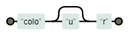
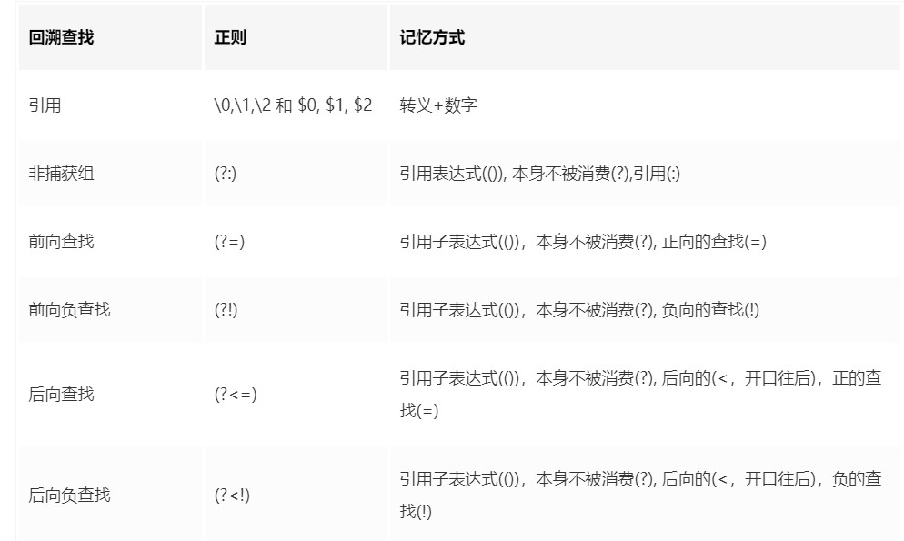
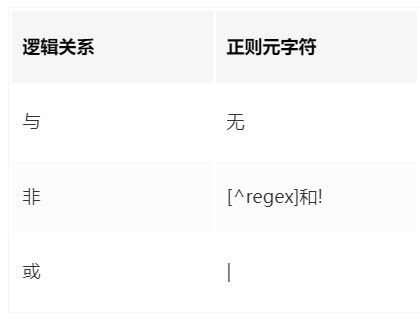
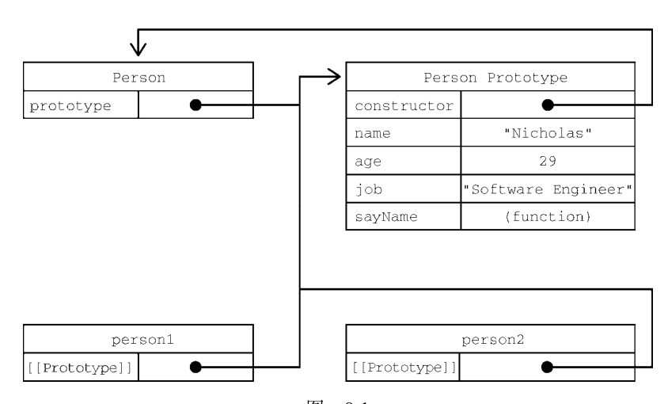

## 1. 数学建模

* 负责算法建模部分
* matlab 是一个软件，主要用来进行科学运算（像数值分析、矩阵运算、数据可视化以及动态系统的建模和仿真）；
* matlab的基本运算单位是矩阵，因此解决科学运算问题比传统的c要简单得多；
* matlab还可以用来处理数据，具体到比赛的过程中的话，处理数据并不是我负责的，我负责的主要是分析数据以及建模。当时的题目是分析中小微企业的信贷问题，我们首先对原始数据进行分析，最后得到相关系数较为合理的指标，然后使用topsis优劣解距离法评价综合能力；我负责的就是编写topsis部分的代码；
* python 用于 bp神经网络 的训练

## 2. 熟练 DIV+CSS 页面布局

* css + div 是一种网页设计模式，DIV 承担了网页的内容，CSS 承担了网页的样式。
* 使网页的内容和样式的分离开来。有利于页面的维护升级。
* 有助于搜索引擎快速找到内容；有助于页面的重构；（比如换皮肤功能，只要换一套样式就可以了）

## 3. 重构

### 为什么要重构

* 避免软件在迭代过程中代码设计越来越糟糕，导致难以开发；
* 更好地定位错误并修改代码；（比如我在开发博客时，有个功能是有新建博客和更新博客的功能，它们都需要一个markdown编辑器,唯一的不同是发送的ajax请求不一样，一个时post新增博客，一个是patch更新博客，为了方便开发一开始我直接ctrl cv了之前的新建博客的页面给更新博客的页面，完成功能后还好，没有什么太大的问题，毕竟功能都实现好了，但是在那个时候遇到了跨域的问题，需要更改请求的nginx的代理服务器的端口。结果就要修改多次重复逻辑的代码；因为用的是vue，所以后面就用组件化开发和模块化请求开发了，这样只要修改一处文件记好了）

### 重构哪些地方

* 变量命名要规范有关联
* 提炼重复的代码提高复用
* 函数不宜过长，过长则要拆分降低耦合
* 减少全局变量避免难以维护，必要的全局变量要加以封装，控制对其的访问
* 对一个数据的操作尽量封装到一个文件里
* for循环尽量使用高阶函数可读性（filter map reduce等）

## 4. 熟悉 w3c 标准

* html5

  * 2008年
  * 语义化
* css3
* DOM

## 5. HTML 语义化

写语义化标签应该注意什么？

* 尽可能少的使用无语义的标签div和span
* 不使用纯样式标签
* 使用表格时，标题要用caption，表头用thead，主体部分用tbody包围，尾部用tfoot包围。表头和一般单元格要区分开，表头用th，单元格用td；
* 表单域要用fieldset标签包起来，并用legend标签说明表单的用途；

常用的一些语义化标签

* `<h1>~<h6>` 标题
* `<p>` 段落
* `<ul>、<ol>、<li>` ul无序列表 ol有序列表
* `<dl>、<dt>、<dd>` dl开启一个定义列表，dt表示要定义的项目名称，dd表示对dt的项目的描述。
* `<em>、<strong>` 强调、重点强调
* `<table>、<thead>、<tbody>、<td>、<th>、<caption>` 用来做表格不要用来布局

HTML5新增

* header
* footer
* nav
* aside
* section
* article

## 6. 熟悉Ajax/Json

什么是 ajax?

* 异步JavaScript和XML，一种异步请求数据的web开发技术。
* Ajax的目的是提高用户体验，较少网络数据的传输量。
* AJAX请求获取的是数据而不是HTML文档，因此它也节省了网络带宽。

AJAX原理是什么？

* 通过XmlHttpRequest对象来向服务器发送异步请求获得数据；
* 异步获取完数据后可以通过操作DOM更新页面；
* Ajax 请求在事件循环中是宏任务，不会阻塞js引擎的执行；

AJAX的使用（同步处理、异步处理）

```js
// 1. 创建 XHR 对象
let xhr = new XMLHttpRequest();
// 2. 初始化 （设置请求方法和 url）
xhr.open("GET", "http://127.0.0.1:8000/server");
// 3. 发送
xhr.send();
// 4. 事件绑定 处理服务器返回的结果
// 当状态改变时会触发事件
xhr.onreadystatechange = function() {
    // readyState 是 XHR 对象的属性，保存0,1,2,3,4值，当值改变时会触发改事件
    // 值状态分别对应 未初始化|已初始化|已发送|服务端返回部分结果|服务端返回全部结果
    if (xhr.readyState === 4) {
        // status 是 XHR 对象属性，对应响应状态码
        if (xhr.status >= 200 && xhr.status < 300) {
            // 处理结果
            // 响应体
            console.log(xhr.status); // 200
            console.log(xhr.statusText); // ok
            console.log(xhr.getAllResponseHeaders()); // content-length: 0
        }
    }
}
```

* 创建xhr对象
* open()初始化，send()发送
* readState 改变时触发 onreadystatechange 事件；（readState 0,1,2,3,4 分别表示 未初始化|已初始化|已发送|服务端返回部分结果|服务端返回全部结果）
* status 是 http 状态码，当它是 2XX 时表示成功

常见面试题

* 什么是ajax 它的作用是什么
* 原生ajax请求有哪几个步骤，分别是什么
* Json对象和Json字符串的相互转换

```js
// 字符串转对象
JSON.parse(json)
// 对象转字符串
JSON.stringify(json)
```

* AJAX几种请求方式？他们的优缺点？

get 和 post

* HTTP常见状态码有哪些？
* 什么情况造成跨域（什么是同源策略）？
* 跨域解决方案有哪些？

## 7. 正则表达式

[正则图示](https://regexper.com/)

字符串要么匹配字符、要么匹配数字

1. 正则表达式的基本组成：

* 字符（数字、英文字母）
* 元字符（特殊字符）

2. 匹配单个字符

* 匹配数字、英文，纯粹就是一一对应的关系，直接用字符即可；
* 匹配特殊字符，需要加上转义符号 `\`

  * 匹配 \* 这个字符 `\*`
  * 匹配换行符`\n`
  * 匹配空白符`\s`
  * ...

3. 匹配多个字符

定义集合匹配多个字符：

* `[123]` 能同时匹配1或者2或者3；
* `[0-9]` 能匹配所有的数字；
* `[a-z]` 能匹配所有的小写英文字母；
* 简便写法：

  * `.` 除了换行符之外的任何字符
  * `\d` 单个数字 即`[0-9]`
  * `\D` 除了`[0-9]`
  * `\w` 包括下划线在内的单个字符`[A-Za-z0-9_]`
  * `\W`
  * `\s` 匹配空白字符
  * `\S` 匹配非空白字符

4. 循环与重复

* `?` 匹配一个或者多个

  * 比如`/colou?r/`



* `*` 匹配 0 个或者无数个
* `+` 匹配一次或者多次
* `{}` 匹配特定次数
  * `{x}` 匹配`x` 次
  * `{min,max}` 匹配 min 到 max 次
  * `{min,}` 至少 min 次
  * `{0,max}` 至多 max 次

5. 边界位置

* `\b` （单词边界 boundary）
  * 匹配这样的位置：它的前一个字符和后一个字符不全是(一个是,一个不是或不存在)`\w`。
  * 比如在字符串`The cat scattered his food all over the room.` 匹配`cat`
    * `/\bcat\b/`
* `\B` （非单词边界）
* `^` 字符串开头
* `$` 字符串结尾

6. 模式

* m
* i
* g

7. 子表达式

* 分组
  * 使用`()` 包裹，每一个都是子表达式
* 回溯引用
  * 前向查找
  * 后向查找
* 逻辑处理




## 8. js 面向对象

面向对象的核心：

* 封装
* 继承
* 多态

> ES6 之前并没有正式支持面向对象的结构，比如类或继承。但是巧妙地运用原型式继承可以成功地模拟同样的行为。

在早期创建对象时，通常是创建 `Object` 的实例，再添加它的属性和方法；之后对象字面量成为更加流行的方式；

> 缺点：编写具有同样接口的对象需要很多重复的代码；

* 工厂模式

```js
function createPerson() {
  var o = new Object();
  o.name = 'hanmeimei';
  o.say = function() {
    alert(this.name);
  }
  return o;
}
var person1 = createPerson();
```

优点：
  * 解决了代码复用的问题；

缺点：
  * 无法识别对象；只能知道该对象来自 `Object`，不能确定是否 `createPerson`；
  * createPerson 函数创建对象时，say方法都是一样的逻辑，但是存储了多次； 

* 构造函数模式

```js
function Person() {
  this.name = 'hanmeimei';
  this.say = function() {
    alert(this.name)
  }
}
var person1 = new Person();
```

优点：解决了对象类型的问题；（通过 instanceOf 可以判断）
缺点：实例的 say 方法都是一样的逻辑，但是存储了多次；

* 原型模式

```js
function Person() {}
Person.prototype.name = 'hanmeimei';
Person.prototype.say = function() {
  alert(this.name);
}
Person.prototype.friends = ['lilei'];
var person1 = new Person();
```

每个函数在创建时都会创建一个prototype属性，这个属性是个对象，prototype对象有个constructor指针，指回函数本身；在实例化对象时，实例内部暴露的__proto__属性会指向构造函数的原型；

实例与构造函数原型之间有直接的联系！

通过在构造函数原型上定义方法、属性，就能保证所有的实例都能访问到；

在查找实例的方法、属性时，会首先在实例上查找，如果没有找到，就在原型上找到属性、方法，然后在实例上添加它；


优点：
  * 定义在原型上的方法、属性所有实例共享；

缺点：
  * 引用类型的问题，所有实例对引用类型的值保存的都是同一个内存地址；导致共用；
  * 所有的方法都是共享的，没有办法创建实例自己的属性和方法，也没有办法像构造函数那样传递参数。
  * 不能使用对象字面量简写原型上定义的属性、方法；需要手动设置。（constructor属性指向了新的Object构造函数，需要手动设置`constructor: Person`）
  * 封装性差；（如果原型定义在里面，又会导致代码重复执行，原型里的方法有一个就行）


* 构造函数和原型组合模式

```js
function Person(name) {
  this.name = name
  this.friends = ['lilei']
}
Person.prototype.say = function() {
  console.log(this.name)
}
```

优点：
  * 解决了引用类型值的问题
  * 解决了原型模式没有办法传递参数的缺点

缺点：
  * 不能使用对象字面量简写原型上定义的属性、方法；需要手动设置。
  * 封装性差；

* 动态原型模式

```js
function Person(name) {
  this.name = name
  if(typeof this.say != 'function') {
    Person.prototype.say = function(
    alert(this.name)
  }
}
```

优点：
  * 在初次调用构造函数的时候就完成原型对象的修改


[原型链概念和继承](https://louiszhai.github.io/2015/12/15/prototypeChain/)

继承：

首先阐述原型链的概念：将子类的原型指向父类的实例；

* 原型链继承

```js
function Father(){
    this.property = true;
}
Father.prototype.getFatherValue = function(){
    return this.property;
}
function Son(){
    this.sonProperty = false;
}
//继承 Father
Son.prototype = new Father();//Son.prototype被重写,导致Son.prototype.constructor也一同被重写
Son.prototype.getSonVaule = function(){
    return this.sonProperty;
}
var instance = new Son();
console.log(instance.getFatherValue());//true 表明在原型链上
```

判断原型和实例的关系：

* instanceOf
* 原型上的isPrototypeOf

```js
// 判断原型和实例的继承关系
console.log('instanceOf____');
console.log(instance instanceof Object);//true
console.log(instance instanceof Father);//true
console.log(instance instanceof Son);//true

console.log('isPrototypeOf____');
console.log(Object.prototype.isPrototypeOf(instance));//true
console.log(Father.prototype.isPrototypeOf(instance));//true
console.log(Son.prototype.isPrototypeOf(instance));//true
```

缺点：
  * 引用类型的值被所有实例共享
  * 不能传参


* 盗用构造函数

```js
function Father(){
    this.colors = ["red","blue","green"];
}
function Son(){
    Father.call(this);//继承了Father,且向父类型传递参数
}
var instance1 = new Son();
instance1.colors.push("black");
console.log(instance1.colors);//"red,blue,green,black"

var instance2 = new Son();
console.log(instance2.colors);//"red,blue,green" 可见引用类型值是独立的
```

优点：
  * 引用类型的值独立，不被所有实例共享；
  * 可以传参

缺点：
  * 函数不能复用，不能访问父类原型上的方法


* 组合继承

使用原型链继承原型上的属性和方法，而通过盗用构造函数继承实例属性。

```js
function Father(name){
    this.name = name;
    this.colors = ["red","blue","green"];
}
Father.prototype.sayName = function(){
    alert(this.name);
};
function Son(name,age){
    Father.call(this,name);//继承实例属性，第一次调用Father()
    this.age = age;
}
Son.prototype = new Father();//继承父类方法,第二次调用Father()
Son.prototype.sayAge = function(){
    alert(this.age);
}
var instance1 = new Son("louis",5);
instance1.colors.push("black");
console.log(instance1.colors);//"red,blue,green,black"
instance1.sayName();//louis
instance1.sayAge();//5

var instance1 = new Son("zhai",10);
console.log(instance1.colors);//"red,blue,green"
instance1.sayName();//zhai
instance1.sayAge();//10
```

缺点：
  * 调用了两次父类构造函数

* 原型式继承（`Object.create`）

```js
function object(o){
    // 1. 先创建一个临时性的构造函数
    function F(){}
    // 2. 将传入的对象作为这个构造函数的原型
    F.prototype = o;
    // 3. 返回了这个临时类型的一个新实例
    return new F();
}
```

```js
var person = {
    name : "Van"
};
var anotherPerson = Object.create(person, {
    name : {
        value : "Louis"
    }
});
alert(anotherPerson.name);//"Louis"
```

* 寄生式继承

使用原型式继承可以获得一份目标对象的浅拷贝，然后利用这个浅拷贝的能力再进行增强，添加一些方法，这样的继承方式就叫作寄生式继承。

```js
 let parent5 = {
    name: "parent5",
    friends: ["p1", "p2", "p3"],
    getName: function() {
      return this.name;
    }
  };
​
  function clone(original) {
    let clone = Object.create(original);
    clone.getFriends = function() {
      return this.friends;
    };
    return clone;
  }
​
  let person5 = clone(parent5);
​
  console.log(person5.getName());
  console.log(person5.getFriends());
```

* 寄生组合式继承（组合继承和寄生式继承结合）

为了解决调用两次父类构造函数的问题

寄生式组合继承通过盗用构造函数继承属性，使用寄生式继承来继承父类原型。

```js
function inheritPrototype(subType, superType) {
    let prototype = Object.create(superType.prototype); // 创建父类原型的一个副本
    prototype.constructor = subType; // 解决重写原型导致默认constructor丢失
    subType.prototype = prototype; // 将新类型的对象赋值给子类型的原型
}

function SuperType(name) {
    this.name = name;
    this.colors = ["red", "blue", "green"];
}
SuperType.prototype.sayName = function () {
    console.log(this.name);
};

function SubType(name, age) {
    // 盗用构造函数继承属性 
    SuperType.call(this, name);
    this.age = age;
}

inheritPrototype(SubType, SuperType);
SubType.prototype.sayAge = function () {
    console.log(this.age);
};
```

## 9. webpack

什么是 webpack

webpack 是一个静态模块打包器。在 Webpack 中，前端的所有资源都会作为模块处理，它将根据模块的依赖进行静态分析，打包生成对应的 bundle。

webpack的五个核心理念

* entry
* output
* loader
  * 让 Webpack 能够去处理那些非 JS 的文件，比如样式文件、图片文件( Webpack 自身只理解 js\json )
* plugin
  * 可以用于执行范围更广的任务。插件的范围包括，从打包优化和压缩，一直到重新定义环境中的变量等。
* mode
  * 指示 webpack 使用相应模式的配置。development或production


webpack 开发环境和生产环境的配置

* 开发环境
  * 打包html、css、图片
  * devServer（最重要的是开启正向代理服务器，在内存里打包）

loader 和 plugin 还有区别在于，plugin需要commonjs规范导入才能使用；

处理html
html-webpack-plugin 会创建一个空的html文件，自动引入打包输出的文件；（如果需要非空的html文件，可以使用template配置）

处理css、less、scss
test参数用于匹配文件，可以使用正则表达式匹配。use是一个数组，可以配置多个loader处理文件；
scss-loader用于编译scss为css；css-loader用于将css文件变成commonjs模块加载到js中（内容是字符串） style-loader用于创建style标签，添加到head中；

处理图片
url-loader 用于处理图片资源问题，但是默认不会处理html文件中引入的图片，html-loader处理这个问题；

file-loader用于所有静态文件，打包后加入哈希值，有利于浏览器的协商缓存；


webpack生产环境的配置

* 压缩
* 兼容性
  * postcss-loader
  * babel-loader
* js语法检查
  * eslint-loader


优化：

开发环境下：

* 热模块替换
  * devServer 里配置 hot
* source-map
  * 通过devtool

生产环境下：

* oneOf 匹配其中一个loader
* babel 缓存和文件资源缓存（hash）
* 多进程打包（thread-loader）
* externals（让某些库不打包，通过 cdn 引入）


## 10. babel

babel是js语法转换器

* parser 代码解析
* transform 代码转换
* 代码生成

1. 将代码解析，即转换成AST（抽象语法树）
* 词法分析: 将代码(字符串)分割为token流,即语法单元组成的数组
* 语法分析: 分析token流(上面生成的数组)并生成 AST

哪些属于语法单元：

* 数字
* 括号
* 标识符
* 运算符
* 注释、中括号

首先要做的就是写一个词法分析器，接收字符串返回token数组；

语法分析要比词法分析复杂得多（分析各种语法的可能性,需要开发者根据token流(上一节我们生成的 token 数组)提供的信息来分析出代码之间的逻辑关系）

js Parse 最好符合 estree 规范，还要考虑作用域的问题；


2. 代码转换

转换代码的关键就是根据当前的抽象语法树,以我们定义的规则生成新的抽象语法树,转换的过程就是生成新抽象语法树的过程.

比如 uniapp 就是使用 babel 完成的小程序语法转换；

* babel 将 Vue 代码解析为抽象语法树
* 开发者利用 babel 插件定义转换规则，根据原本的抽象语法树生成一个符合小程序规则的新抽象语法树
* babel 则根据新的抽象语法树生成代码，此时的代码就是符合小程序规则的新代码

3. 生成代码

根据转换后的抽象语法树来生成新的代码


## 11. git

